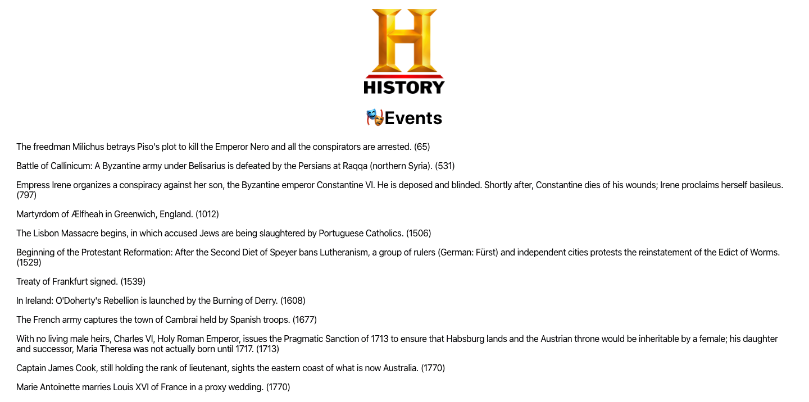

## History in Today API { Events | Births | Deaths }

I wanted to write a 'this day in history' react application, which posts events which happened on this day. There's a bunch of databases of historical events out there, but most of them are closed.

